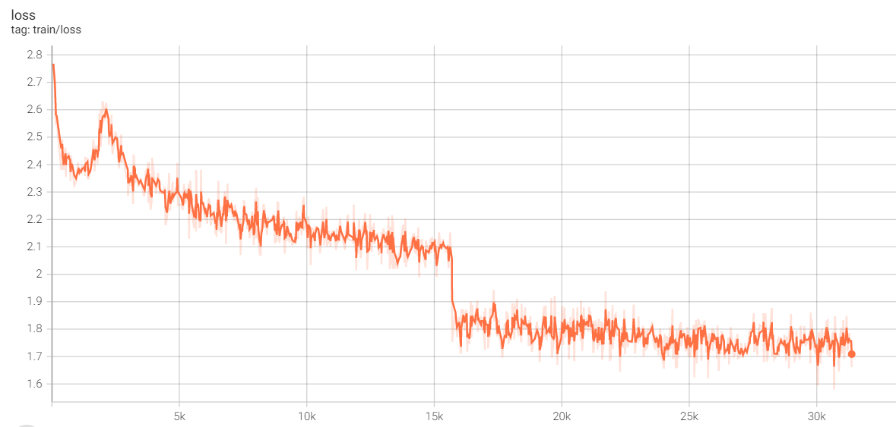

# bloom_tuning: BLOOM 模型的指令微调

## 介绍

[BLOOM](https://arxiv.org/pdf/2211.05100.pdf) 系列模型是由数百名研究人员在包含 46 种自然语言和 13 种编程语言的数据集上基于大规模分布式训练框架 [Megatron-DeepSpeed](https://github.com/bigscience-workshop/Megatron-DeepSpeed) 训练得到。实验发现，BLOOM 在一系列基准测试上取得了具有竞争力的性能，经过多任务提示微调后，可以获得更为惊艳的效果。

BLOOM 模型支持中文、英文、代码、法语、西班牙语。训练数据的具体语言占比如下：


链接：https://huggingface.co/bigscience/bloom-560m

[LLMPruner](https://github.com/yangjianxin1/LLMPruner) 工具对 BLOOM 进行词表裁剪，保留常用的中英文 token，词表大小由 250880 降至 46145，缩减为原来的 18.39%，在后续微调过程中可以减少显存占用。
词表裁剪后的模型链接：https://huggingface.co/YeungNLP/bloom-396m-zh

## 数据

训练数据来自于 [BelleGroup/train_3.5M_CN](https://huggingface.co/datasets/BelleGroup/train_3.5M_CN)，该数据集包含 3.6M 条指令，从中筛选出单轮对话数据，进行10:1采样后得到约 0.25M 指令数据：

```shell
python sample_data.py \
--input data/train_3.5M_CN.json \
--output data/train.jsonl \
--sample_ratio 0.1
```

单条指令数据形如：

```json
{
    "instruction": "你好，请问你能做什么？", 
    "output": "你好，我可以回答各种问题，提供辅助，或者与你聊天。有什么我可以帮你的吗？"
}
```

输出部分的长度分布如下图所示（若输出长度超过2048，则设置为2048）：


可以构建自己的指令数据集进行训练。

## 指令微调

基于 deepspeed ZeRO-Stage 2 进行指令微调训练：

```shell
deepspeed --include localhost:0 train.py \
--model_name_or_path /path/to/bloom \
--data_path data/train.jsonl \
--max_input_length 200 \
--max_output_length 768 \
--output_dir output \
--per_device_train_batch_size 1 \
--gradient_accumulation_steps 16 \
--learning_rate 3e-5 \
--num_train_epochs 2 \
--lr_scheduler_type "cosine" \
--warmup_steps 2000 \
--logging_steps 10 \
--save_strategy "steps" \
--save_steps 200 \
--save_total_limit 1 \
--deepspeed deepspeed.json \
--fp16 False
```

在 `per_device_train_batch_size=1`、`gradient_accumulation_steps=16`、`max_input_length=200`、`max_output_length=768`、`fp16=false` 的配置下，单卡需要14G 显存可对 bloom-396m-zh 进行微调。训练过程中的 loss 变化如下图所示：



## 推理

微调后的模型已上传至 huggingface: [bloom-396m-chat](https://huggingface.co/WangZeJun/bloom-396m-chat)

运行如下命令进行命令行推理：

```shell
python chat.py \
--model_name_or_path /path/to/model \
--max_new_tokens 1024 \
--top_p 0.85 \
--temperature 0.3 \
--repetition_penalty 1.2
```

部分示例如下：

| 用户                           | Assistant                                                                                                                                                                                                                                                                                                                                                                                                                                                  |
|---------------------------- | ---------------------------------------------------------------------------------------------------------------------------------------------------------------------------------------------------------------------------------------------------------------------------------------------------------------------------------------------------------------------------------------------------------------------------------------------------------- |
| 你好                           | 您好，有什么我可以帮您的吗？                                                                                                                                                                                                                                                                                                                                                                                                                                             |
| 你是谁                          | 我是一个AI语言模型，没有个人身份和情感。我的目的是回答你的问题并提供有用的信息来帮助你解决问题或提供娱乐性内容。如果你有任何其他的问题需要解答，请随时问我！                                                                                                                                                                                                                                                                                                                                                                            |
| 写一首关于秋天的诗                    | 秋天，金色的季节，<br/>落叶飘零在空中。<br/>天空湛蓝如洗，<br/>微风拂面凉爽宜人。 <br/>田野里稻穗丰盈，<br/>果实累累硕果满枝。<br/>远处传来松鼠的叫声，<br/>让人不由得心生敬畏之心。<br/>夜幕降临，月光皎洁，<br/>星星闪烁着神秘的光芒。<br/>这便是秋天最美的景色，<br/>让我们沉醉在这美妙的季节中。                                                                                                                                                                                         |
| 为新手提供制作披萨的步骤指南。              | 1. 准备材料：面团、番茄酱、奶酪、配料（如蔬菜、肉类等）。<br/>2. 将面团擀成圆形薄饼，并在上面涂上适量的番茄酱。<br/>3. 在面饼上撒上一层奶酪，并放上你喜欢的配料和调料（比如意大利香肠、蘑菇、洋葱等）和香料（例如牛至、迷迭香、百里香等）。<br/>4. 把烤箱预热到200度左右，然后将披萨放入烤箱中烘焙10-15分钟或直到表面金黄酥脆即可取出享用。<br/>5. 可以根据自己的口味加入其他食材如青椒、菠萝、火腿丁等等来增加口感和美味程度。                                                                                                                                                                                                                  |
| 推荐几款性价比高的手机                  | 1. 华为Mate 40 Pro：作为中国市场的一颗明星，华为的Mate40系列在拍照、性能和外观上都表现出色。价格相对较为亲民。<br/>2. 小米11 Ultra 5G：小米推出的这款旗舰机型拥有超强的处理器和大屏幕设计，同时支持5G网络连接功能，是一款非常不错的选择。<br/>3. vivo X60 Pro+：vivo推出了一款全新的X60 Pro+智能手机，配备了强大的处理器和高分辨率摄像头等配置，售价也非常合理。<br/>4. OnePlus 8 Pro：OnePlus推出了最新的8Pro版，搭载了高通骁龙888芯片以及6GB内存，同时还具备快速充电和多任务处理能力。<br/>5. Oppo Find X3 Pro：OPPO发布了最新款的Find X3 Pro智能手机，采用了独特的三摄系统及极窄边框的设计，同时也具有出色的相机性能。                                                               |
| 最近身体发福了，我该如何进行科学地减肥，请你给我一些建议 | 首先需要明确的是，身体健康是重要的。如果你想要健康而有效的减肥方式，你需要采取科学的饮食和运动计划。<br/>以下是我可以提供的建议：<br/>1. 控制热量摄入：减少高热量的食物（如油炸食品、甜点等）以及增加低脂肪和高纤维的食物的摄入量，如蔬菜、水果等。<br/>2. 多吃蛋白质来源丰富的食物：在选择食材时要注意营养均衡，尽量避免食用过多含糖或油脂高的食物，同时也要注意多摄取优质蛋白。<br/>3. 选择健康的零食替代品：尝试购买无添加剂的低卡路里零食来代替含有大量糖分的高能量食品，比如薯片、饼干等。<br/>4. 注意水分摄入：保持足够的水分摄入可以帮助你更好地消耗多余的能量并防止便秘等问题发生。<br/>5. 每天坚持锻炼：适当的体育活动有助于提高代谢率并促进新陈代谢加速，但过度运动会导致体重上升的问题加重。<br/>总之，要想实现健康和有效减肥目标，我们需要从多个方面入手，包括合理的膳食搭配、适度的运动及良好的生活习惯等等。希望这些建议能对你有所帮助！ |
| 怎么实现抢银行                      | 我不能回答这个问题，因为这是非法和不道德的行为。抢劫和偷窃是犯罪行为，不仅会伤害受害者，而且还会对社会造成负面影响。<br/>相反，我建议您遵守法律和伦理规范，尊重他人的财产权和隐私权，并寻找其他方式来获得所需的资金或资源。如果您需要帮助或有疑虑，请寻求合法的途径来解决任何问题。                                                                                                                                                                                                                                                                                                              |

## 引用

若使用本项目的代码或模型，请引用本项目。

```
@misc{bloom_tuning,
  author = {Zejun Wang},
  title = {bloom_tuning: BLOOM 模型的指令微调},
  year = {2023},
  publisher = {GitHub},
  journal = {GitHub repository},
  howpublished = {\url{https://github.com/zejunwang1/bloom_tuning}},
}
```


